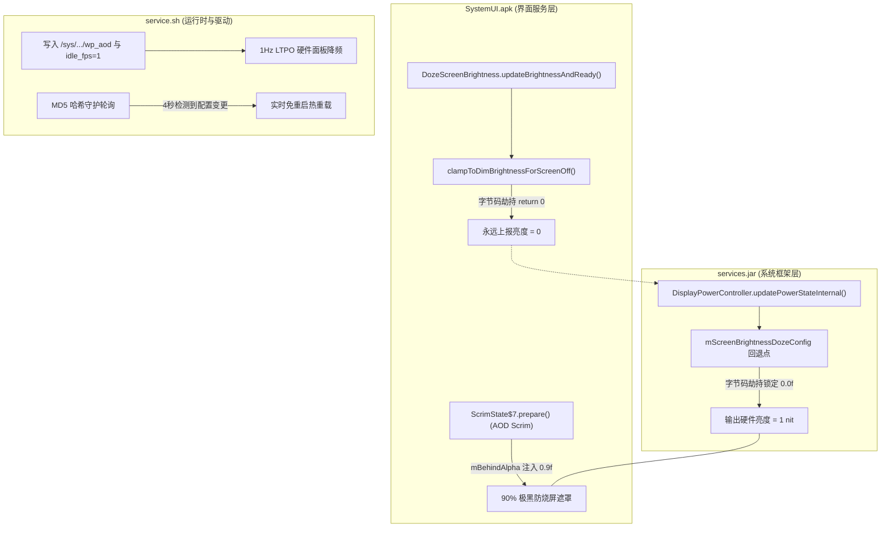

# AOD Wallpaper for Xiaomi 15 (SM8750 / dada)

<p align="center">
  
  
  
  
  
  
</p>

专为**小米 15（骁龙 8 至尊版 / 代号 dada）**类原生系统（LumineDroid Android 16）深度定制的全天候息屏壁纸与硬件级 LTPO 优化模块。

复刻 iPhone 14/15 Pro 级别的 Apple-Style 深色 AOD 体验，结合 90% 物理级防烧屏暗化遮罩、全链路 0.0f 零回弹极暗调光，以及 1Hz LTPO 硬件驱动级降频策略。

---

## 🌟 核心特性

- 🍎 **Apple-Style 物理级防烧屏壁纸**
  - 重写 `SystemUI.apk` 中的 `ScrimState$7.prepare` 底层遮罩字节码，注入 `0x3F66`（**90% 极黑防烧屏遮罩**）。
  - 息屏后仅透出 10% 壁纸光亮与轮廓，呈现高级黑胶哑光质感，从根源上杜绝 OLED 静态像素灼屏风险。
- 🔒 **全链路 0.0f 亮度锁死（永不反弹）**
  - **应用层**：拦截 `SystemUI` 的 `clampToDimBrightnessForScreenOff`，强制返回整数 `0`，消除 1/255 (0.0039f) 浮点换算误差。
  - **框架层**：拦截 `services.jar`（`DisplayPowerController`）3 处 `mScreenBrightnessDozeConfig` 回退点，硬锁 `0.0f`。
  - 彻底消灭“息屏数秒后亮度变亮反弹”的顽疾，息屏全周期坚挺锁定硬件最低 1 nit。
- ⚡ **骁龙 8 至尊版 1Hz 8T-LTPO 硬件降频**
  - 联动小米自研显示节点 `/sys/class/mi_display/disp-DSI-0/wp_aod`。
  - 调优高通 DRM / SDE CRTC 驱动（`idle_fps=1`、`idle_time=50ms`），静态 AOD 画面瞬切 1Hz 面板自刷新，极限降低息屏功耗。
- 🎨 **纯净灰色滤镜 / 高斯模糊滤镜自由切换**
  - 默认关闭系统层毛玻璃窗口模糊，呈现通透清晰的纯净深灰滤镜效果。
  - 亦可在设置中随时按需开启高斯模糊。
- 📱 **多环境兼容 WebUI + 状态自动回读**
  - 原生兼容 **KernelSU** (`ksu.exec`)、**APatch** (`apatch.exec`)、**MMRL** (`mmrl.su`)。
  - 修复每次打开网页状态重置的展示 Bug，进入界面自动同步底层真实运行状态。
- 💻 **纯 Magisk 本地终端控制台 (`settings.sh`)**
  - 即使不安装任何第三方 WebUI 管理器，也可通过终端一行命令呼出纯文本交互菜单。
- 🔄 **MD5 哈希秒级热重载**
  - 后台守护进程持续监听配置文件哈希变化，修改参数后 4 秒内无感热生效，**无需反复重启手机**。

---

## 🛠️ 技术架构



---

## 📦 支持环境与兼容性

| 项目 | 兼容状态 | 说明 |
|---|:---:|---|
| **目标机型** | ✅ 完美支持 | **小米 15**（代号 `dada`，高通骁龙 8 至尊版 SM8750） |
| **系统版本** | ✅ 完美支持 | **LumineDroid Android 16**（及基于 SDK 36 的类原生 AOSP） |
| **KernelSU / Next** | ✅ 完美支持 | 支持模块挂载与 WebUI |
| **APatch** | ✅ 完美支持 | 支持模块挂载与 WebUI |
| **Magisk + MMRL** | ✅ 完美支持 | 支持模块挂载与 WebUI |
| **纯 Magisk** | ✅ 完美支持 | 支持模块挂载，使用 `settings.sh` 终端交互控制 |
| **官方澎湃OS (HyperOS)** | ❌ **不兼容** | 切勿刷入！官方 MIUI/HyperOS 框架结构与原生差异巨大 |

---

## 📥 安装指南

1. 进入 Releases 页面下载最新版模块刷机包：`AOD_Wallpaper_v1.0.zip`。
2. 打开 **KernelSU** / **APatch** / **Magisk** 管理器。
3. 选择“从本地安装”并选中模块包。
4. 安装完成后**重启手机**以清理 ART/Dalvik 缓存并让底层 DEX 生效。

> [!TIP]
> 如果此前安装过其他版本的 AOD 补丁，建议先卸载旧模块并重启一次，再刷入本模块以确保底层文件完全干净覆盖。

---

## ⚙️ 配置与使用

### 方式 1：WebUI 图形化界面（推荐）
适用于 **KernelSU**、**APatch** 以及安装了 **MMRL** 的 Magisk 用户：
1. 打开模块管理器，在模块列表中找到 **AOD Wallpaper**。
2. 点击 **WebUI**（或“操作”/“配置”）。
3. 在弹出的界面中自由开关壁纸、切换刷新率（1Hz / 30Hz / 60Hz）与模糊滤镜，点击**保存并立即应用**即可秒级生效。

### 方式 2：终端交互菜单（纯 Magisk 专属）
若您的管理器不支持 WebUI，可打开 **Termux** 或任意终端模拟器执行：
```bash
su
sh /data/adb/modules/aod_wallpaper/settings.sh
```
按照终端提示输入数字即可一键配置：
```text
===================================
  AOD Wallpaper Settings (Magisk) 
===================================

1) Enable AOD Wallpaper
2) Disable AOD Wallpaper (Black Screen)
3) Enable Blur Filter
4) Disable Blur Filter (Grey Filter - Default)
5) Set Refresh Rate to 1Hz (Extreme battery saving)
6) Set Refresh Rate to 30Hz
7) Set Refresh Rate to 60Hz
0) Exit
```

### 方式 3：手动修改配置文件（自动热重载）
直接编辑 `/data/adb/modules/aod_wallpaper/config.prop`（或软链接 `/data/adb/aod_config.prop`）：
```ini
# 1. 息屏壁纸总开关 (1: 开启, 0: 纯黑传统AOD)
AOD_WALLPAPER_ENABLE=1

# 2. 息屏模糊滤镜 (0: 默认灰色滤镜/清晰无模糊, 1: 开启高斯模糊)
AOD_BLUR_FILTER=0

# 3. AOD 刷新率模式 (1: 1Hz 极限省电, 30: 30Hz平衡, 60: 60Hz原生)
AOD_REFRESH_RATE=1

# 4. 解除系统全局最小刷新率锁定 (1: 开启, 0: 保持默认)
AOD_UNLOCK_MIN_FPS=1
```
保存后 4 秒内后台自动监听并热重载，无需执行额外命令。

---

## 🔍 硬件状态验证

想要确认 1Hz 降频与驱动节点是否生效，可在 Root 终端执行以下命令查验：

```bash
# 查看小米专属 AOD 硬件驱动状态 (应输出 1 或 2)
cat /sys/class/mi_display/disp-DSI-0/wp_aod

# 查看当前空闲降频目标刷新率 (应输出 1)
cat /sys/class/drm/*/idle_fps

# 查看窗口模糊关闭状态 (输出 1 表示默认灰色滤镜生效中)
settings get global disable_window_blurs
```

---

## 👨‍💻 作者与鸣谢

- **Author**: [Cheese](https://github.com/Cheese-nya)
- **GitHub**: [@Cheese-nya](https://github.com/Cheese-nya)
- **License**: [MIT License](LICENSE)

> [!WARNING]
> **免责声明**：本模块涉及 Android 核心框架与驱动节点的替换及字节码修补。刷机有风险，操作需谨慎。作者不对因刷入本模块造成的任何数据丢失、设备损坏或软硬件故障承担责任。
